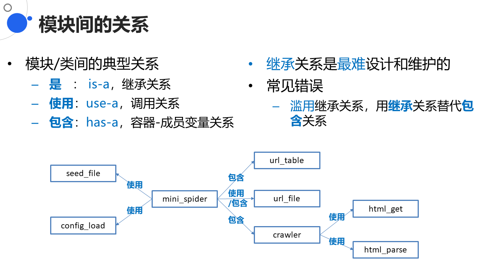
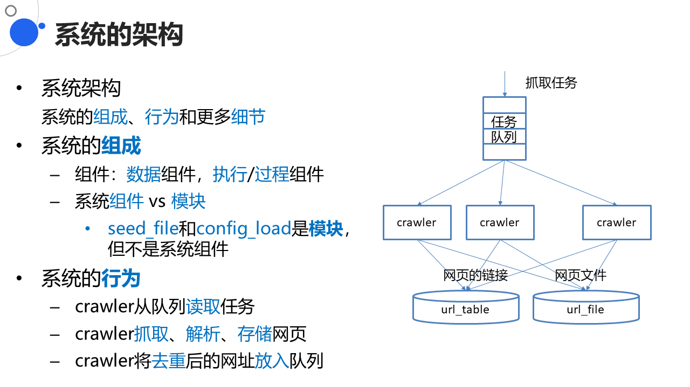
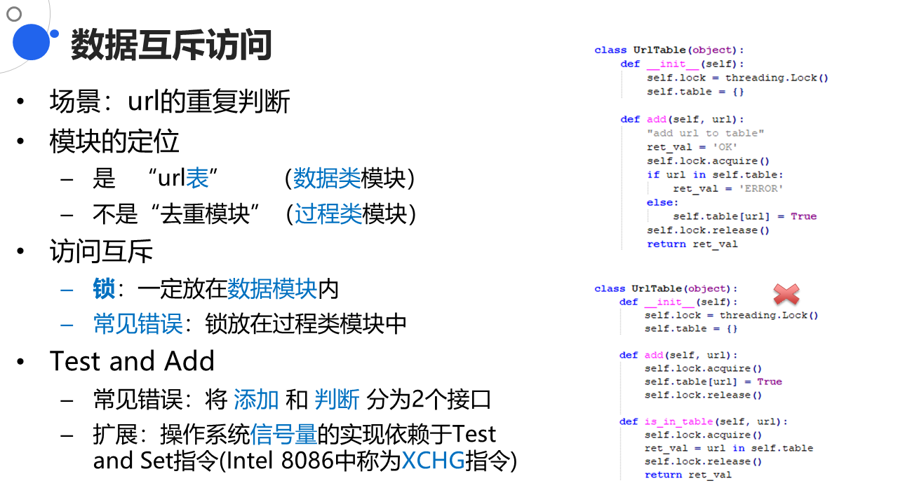

# Mini Spider

**项目背景：**

- 实现一个迷你定向抓取器
- 实现对种子链接、及抓取网页中所包含链接的抓取
- 如果链接符合特定的Pattern，则把抓取的网页保存到磁盘
- 输入
  - 种子文件：一些初始的网页url地址
  - 配置文件：最大线程数、最大抓取深度
- 要求
  - 每个网页单独保存为一个文件，以URL为文件名
  - 支持多线程并行抓取

## 程序架构

## 多线程程序的编写

